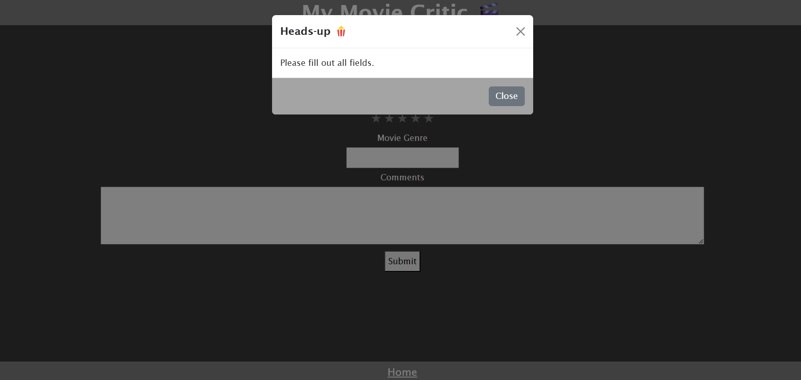

# Project1-Team2

## Description

We built a website where the users can store the information of a movie. The application was created because movie fans want to keep track of the movies they've watched so far, as well as make comments about them. The user can enter the title, rating, genre and some comments of a movie. Also, the users are able to organize the movie information they store alphabetically. In the third page, the users are able to see the details of every movie they've stored.

We've improved our coding skills, because we have built a solid HTML structure within our webiste, so we can manipulate elements in a more efficient way. Also, we have learned how to make a responsive and polished User Interface by implementing CSS to our website and targeting the HTML elements using CSS selectors. Finally, while using JavaScript we were able to be more creative, and we added more features to our website. We have a better understanding of how to work with arrays, functions, methods, objects, event listeners, data attributes and local storage.

Along with this, we acquired knowledge of team collaboration, because when we were working with the Git version control, we had to resolve some merge conflicts when pulling or pushing code. Also, as a team, we applied Agile Software Development methologies to our web application, bacause we planned our website, then we coded, we were building the website, we tested it, and then we released it. In addition to this, as we were coding we added comments in our code, so our team, as well as future developers, can understand the code functionality.

## Table of Contents

- [Usage](#usage)
- [Credits](#credits)
- [License](#license)

## Usage

The website has three pages: Main, Input and Movie Info. The user can navigate through every page.

In the Main page, the user can see the name of the website, followed by the "Enter new movie name" box, and the movie list stored in local storage. The user can enter the movie title and hit the Submit button, which will redirect the user to the Input page.

In the Input page, the user is able to enter more movie information, such as rating, genre and comments. All the information can be stored by hitting the Submit button. At the very botton of the page, there is a hyperlink button that directs a user back to the Main page. When a user submits all the movie information needed to continue, there is a popup notification (Modal) displayed on the screen that tells a user that the information has been successfully submitted. The popup notification will be visible for five seconds, and after that, the user will be redirected to the Main page, where the new submitted movie information will be displayed.

In the Movie Info page, the movie information is displayed with more details about it, such as comments. The user is able to access this page by clicking on the movie list located in the Main page. At the botton of the Movie Info page, there are two hyperlink buttons, which can redirect the user to either the Main page, or the Input page. It's very important to say that every text field must be filled out, otherwise, an error message will be displayed to the user, indicating that in order to proceed, all the text fields must be filled in.

## Credits

Cabrera, Jose   https://github.com/JoseMCabreraT

Chi, Julius     https://github.com/JuliusC72

Neff, Aeralyn   https://github.com/aaeralynn

Webert, Lauren  https://github.com/lwebert

## License

MIT License

Copyright (c) [2024] [Aeraly Neff, Jose Cabrera, Julius Chi, Lauren Webert]

Permission is hereby granted, free of charge, to any person obtaining a copy
of this software and associated documentation files (the "Software"), to deal
in the Software without restriction, including without limitation the rights
to use, copy, modify, merge, publish, distribute, sublicense, and/or sell
copies of the Software, and to permit persons to whom the Software is
furnished to do so, subject to the following conditions:

The above copyright notice and this permission notice shall be included in all
copies or substantial portions of the Software.

THE SOFTWARE IS PROVIDED "AS IS", WITHOUT WARRANTY OF ANY KIND, EXPRESS OR
IMPLIED, INCLUDING BUT NOT LIMITED TO THE WARRANTIES OF MERCHANTABILITY,
FITNESS FOR A PARTICULAR PURPOSE AND NONINFRINGEMENT. IN NO EVENT SHALL THE
AUTHORS OR COPYRIGHT HOLDERS BE LIABLE FOR ANY CLAIM, DAMAGES OR OTHER
LIABILITY, WHETHER IN AN ACTION OF CONTRACT, TORT OR OTHERWISE, ARISING FROM,
OUT OF OR IN CONNECTION WITH THE SOFTWARE OR THE USE OR OTHER DEALINGS IN THE
SOFTWARE.